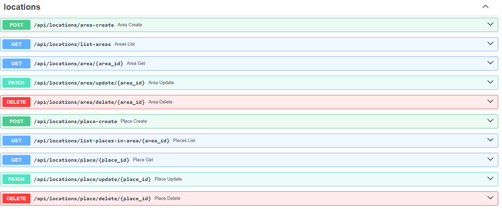
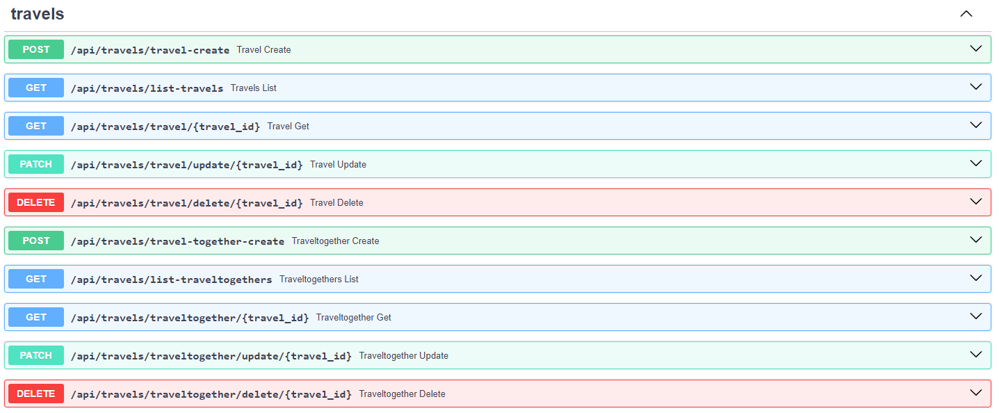
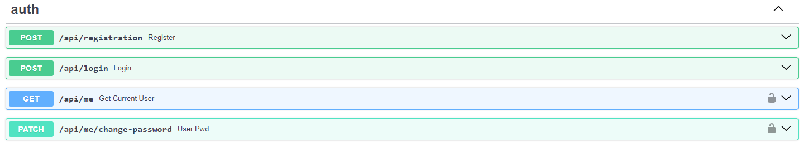
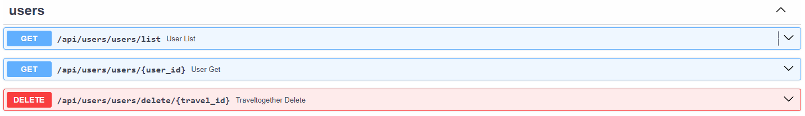
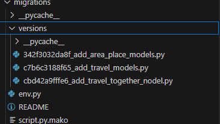

# Отчет по лабораторной работе №1

#### Цель работы:

Научится реализовывать полноценное серверное приложение с помощью фреймворка FastAPI с применением дополнительных средств и библиотек.

## Задание

#### Текст задания:

1. Выполнить практики 2.1-2.3 Их можно реализовать на примере, приведенном в текстах практик или используя выбранную тему. Практики можно предоставить в любом из ниже приведенных вариантов:
   a. Каждая практика - отдельная папка в репозитории.
   b. Каждая практика - отдельная ветка в репозитории.
   c. Каждая практика - отдельный коммит в репозитории.
2. Задание на 9 Баллов: Реализовать на основании выбранной модели с помощью инструкций из практик серверное приложение на FastAPI. Оно должно включать в себя:
   a. Таблицы, реализованные с помощью ORM SQLAlchemy или SQLModel с использованием БД PostgreSQL.
   b. API, содержащее CRUD-ы. Там где это необходимо, реализовать GET-запросы возвращающие модели с вложенными объектами (связи many-to-many и one-to-many).
   c. Настроенную систему миграций с помощью библиотеки Alembic.
   d. Аннотацию типов в передаваемых и возвращаемых значениях в API-методах.
   e. Оформленную файловую структуру проекта с разделением кода, отвечающего за разную бизнес-логику и предметную область, на отдельные файлы и папки.
   f. (опционально) Комментарии к сложным частям кода.
3. Задание на 15 Баллов (можно реализовывать сразу): Необходимо реализовать функционал пользователя в разрабатываемом приложении. Функционал включает в себя:
   a. Авторизацию и регистрацию
   b. Генерацию JWT-токенов
   c. Аутентификацию по JWT-токену
   d. Хэширование паролей
   e. Дополнительные АПИ-методы для получения информации о пользователе, списка пользователей и смене пароля

#### Ссылка на практики

[https://github.com/Ilya3716/ITMO_ICT_WebDevelopment_tools_2023-2024/tree/lab-1/students/k33402/Samarov_Ilya](https://github.com/Ilya3716/ITMO_ICT_WebDevelopment_tools_2023-2024/tree/lab-1/students/k33402/Samarov_Ilya)

#### Ход Работы:

Для начала определим структуру проекта, были выделены несколько сущностей:

1. endpoints(auth_endpoints, user_endpoints, location_endpoints, travel_endpoints) - для обработки запросов
2. models - для хранения проекта
3. отдельный файлы такие как, main, auth, database

На первом шаге инициализируем приложение и подключаем базу данных:

main.py

<hr>

```
from fastapi import FastAPI
import uvicorn
from database import init_db
from location_endpoints import location_router
from travel_endpoints import travel_router
from auth_endpoints import auth_router
from user_endpoints import user_router


app = FastAPI()

app.include_router(location_router, prefix="/api/locations", tags=["locations"])
app.include_router(travel_router, prefix="/api/travels", tags=["travels"])
app.include_router(auth_router, prefix="/api", tags=["auth"])
app.include_router(user_router, prefix="/api/users", tags=["users"])


@app.on_event("startup")
def on_startup():
    init_db()


if __name__ == '__main__':
    uvicorn.run('main:app', host="localhost", port=8000, reload=True)
```

database.py

```
from sqlmodel import SQLModel, Session, create_engine
import os
from dotenv import load_dotenv

load_dotenv()
engine = create_engine(os.getenv('DB_URL'), echo=True)


def init_db():
    SQLModel.metadata.create_all(engine)


def get_session():
    with Session(engine) as session:
        yield session
```

Для авторизации используются jwt токены

auth.py

<hr>

```
import datetime
from fastapi import Security, HTTPException, Depends
from fastapi.security import HTTPBearer, HTTPAuthorizationCredentials
from passlib.context import CryptContext
import jwt
from starlette import status
from database import get_session
from models import User
from sqlmodel import select

security = HTTPBearer()
pwd_context = CryptContext(schemes=['bcrypt'])
secret_key = 'supersecret'


def get_password_hash(password):
    return pwd_context.hash(password)


def verify_password(password, hashed_password):
    return pwd_context.verify(password, hashed_password)


def encode_token(user_id):
    payload = {
        'exp': datetime.datetime.utcnow() + datetime.timedelta(hours=8),
        'iat': datetime.datetime.utcnow(),
        'sub': user_id
    }
    return jwt.encode(payload, secret_key, algorithm='HS256')


def decode_token(token):
    try:
        payload = jwt.decode(token, secret_key, algorithms=['HS256'])
        return payload['sub']
    except jwt.ExpiredSignatureError:
        raise HTTPException(status_code=401, detail='Expired signature')
    except jwt.InvalidTokenError:
        raise HTTPException(status_code=401, detail='Invalid token')


def auth_wrapper(auth: HTTPAuthorizationCredentials = Security(security)):
    return decode_token(auth.credentials)


def get_current_user(auth: HTTPAuthorizationCredentials = Security(security), session=Depends(get_session)):
    credentials_exception = HTTPException(
        status_code=status.HTTP_401_UNAUTHORIZED,
        detail='Could not validate credentials'
    )
    username = decode_token(auth.credentials)
    if username is None:
        raise credentials_exception
    user = session.exec(select(User).where(User.username == username)).first()
    if user is None:
        raise credentials_exception
    return user

```

Были созданы все необходимые модели

models.py

<hr>

```
import datetime
from pydantic import BaseModel
from enum import Enum
from typing import Optional, List
from sqlmodel import SQLModel, Field, Relationship


class TypeOfTravel(Enum):
    elite_hotel = "elite_hotel"
    pretty_simple_hotel = "pretty_simple_hotel"
    apartments = "apartments"
    tents = "tents"


class PlaceRating(Enum):
    five = '5'
    four = '4'
    three = '3'
    two = '2'
    one = '1'
    zero = '0'


class PlaceBase(SQLModel):
    name: str
    description: str
    place_rating: PlaceRating
    area_id: Optional[int] = Field(default=None, foreign_key="area.id")


class PlaceShow(PlaceBase):
    area: Optional["Area"] = None


class Place(PlaceBase, table=True):
    id: int = Field(default=None, primary_key=True)
    area: Optional["Area"] = Relationship(back_populates="places")


class AreaBase(SQLModel):
    name: str
    description: str


class AreaShow(AreaBase):
    places: Optional[List["Place"]] = None


class Area(AreaBase, table=True):
    id: int = Field(default=None, primary_key=True)
    places: Optional[List["Place"]] = Relationship(back_populates="area",
                                                   sa_relationship_kwargs={
                                                       "cascade": "all, delete",
                                                   }
                                                   )
    from_location: Optional["Travel"] = Relationship(back_populates="location_from",
                                                     sa_relationship_kwargs=
                                                     dict(foreign_keys="[Travel.location_from_id]"),
                                                     )

    to_location: Optional["Travel"] = Relationship(back_populates="location_to",
                                                   sa_relationship_kwargs=
                                                   dict(foreign_keys="[Travel.location_from_id]"),
                                                   )

class TravelTogetherBase(SQLModel):
    comment: str
    travel_id: Optional[int] = Field(default=None, foreign_key="travel.id")
    traveller_id: Optional[int] = Field(default=None, foreign_key="user.id")


class TravelTogetherShow(TravelTogetherBase):
    travels: Optional["Travel"] = None
    travellers: Optional["User"] = None


class TravelTogether(TravelTogetherBase, table=True):
    id: int = Field(default=None, primary_key=True)
    travels: Optional["Travel"] = Relationship(back_populates="traveltogethers")
    travellers: Optional["User"] = Relationship(back_populates="traveltogethers")


class TravelBase(SQLModel):
    location_from_id: Optional[int] = Field(default=None, foreign_key="area.id")
    location_to_id: Optional[int] = Field(default=None, foreign_key="area.id")
    path_description: str
    date_start:  datetime.datetime
    date_end:  datetime.datetime
    type_of_travel: TypeOfTravel


class TravelShow(TravelBase):
    location_from: Optional["Area"] = None
    location_to: Optional["Area"] = None


class Travel(TravelBase, table=True):
    id: int = Field(default=None, primary_key=True)
    location_from: Optional["Area"] = Relationship(back_populates="from_location",
                                                   sa_relationship_kwargs=
                                                   dict(foreign_keys="[Travel.location_from_id]"),
                                                   )
    location_to: Optional["Area"] = Relationship(back_populates="to_location",
                                                 sa_relationship_kwargs=
                                                 dict(foreign_keys="[Travel.location_to_id]"),
                                                 )

    travellers: Optional[List["User"]] = Relationship(
        back_populates="travels", link_model=TravelTogether
    )
    traveltogethers: Optional[List["TravelTogether"]] = Relationship(back_populates="travels")


class UserBase(SQLModel):
    username: str
    password: str


class UserShow(UserBase):
    travels: Optional[List["Travel"]] = None
    traveltogethers: Optional[List["TravelTogether"]] = None


class User(UserBase, table=True):
    id: int = Field(default=None, primary_key=True)
    travels: Optional[List["Travel"]] = Relationship(
        back_populates="travellers", link_model=TravelTogether
    )
    traveltogethers: Optional[List["TravelTogether"]] = Relationship(back_populates="travellers")


class ChangePassword(SQLModel):
    old_password: str
    new_password: str

```

Далее были реализованы эндпойнты для работы с API

auth_endpoints

<hr>

```
@auth_router.post('/registration', status_code=201, description='Register new user')
def register(user: UserBase, session=Depends(get_session)):
    users = session.exec(select(User)).all()
    if any(x.username == user.username for x in users):
        raise HTTPException(status_code=400, detail='Username is taken')
    hashed_pwd = get_password_hash(user.password)
    user = User(username=user.username, password=hashed_pwd)
    session.add(user)
    session.commit()
    return {"status": 201, "message": "Created"}


@auth_router.post('/login')
def login(user: UserBase, session=Depends(get_session)):
    user_found = session.exec(select(User).where(User.username == user.username)).first()
    if not user_found:
        raise HTTPException(status_code=401, detail='Invalid username and/or password')
    verified = verify_password(user.password, user_found.password)
    if not verified:
        raise HTTPException(status_code=401, detail='Invalid username and/or password')
    token = encode_token(user_found.username)
    return {'token': token}


@auth_router.get('/me', response_model=UserShow)
def get_current_user(user: User = Depends(get_current_user)) -> User:
    return user


@auth_router.patch("/me/change-password")
def user_pwd(user_pwd: ChangePassword, session=Depends(get_session), current=Depends(get_current_user)):
    found_user = session.get(User, current.id)
    if not found_user:
        raise HTTPException(status_code=404, detail="User not found")
    verified = verify_password(user_pwd.old_password, found_user.password)
    if not verified:
        raise HTTPException(status_code=400, detail="Invalid old password")
    hashed_pwd = get_password_hash(user_pwd.new_password)
    found_user.password = hashed_pwd
    session.add(found_user)
    session.commit()
    session.refresh(found_user)
    return {"status": 200, "message": "password changed successfully"}
```

user_endpoints

<hr>

```
@user_router.get("/users/list")
def user_list(session=Depends(get_session)) -> list[User]:
    users = session.exec(select(User)).all()
    user_models = [user.model_dump(exclude={'password'}) for user in users]
    return user_models


@user_router.get("/users/{user_id}")
def user_get(user_id: int, session=Depends(get_session)) -> UserShow:
    user = session.get(User, user_id)
    if not user:
        raise HTTPException(status_code=404, detail="User not found")
    return user


@user_router.delete("/users/delete/{travel_id}")
def traveltogether_delete(user_id: int, session=Depends(get_session)):
    user = session.get(User, user_id)
    if not user:
        raise HTTPException(status_code=404, detail="user not found")
    session.delete(user)
    session.commit()
    return {"ok": True}
```

location_endpoints

<hr>

```
@location_router.post("/area-create")
def area_create(area: AreaBase, session=Depends(get_session)) \
        -> TypedDict('Response', {"status": int,
                                  "data": Area}):
    area = Area.model_validate(area)
    session.add(area)
    session.commit()
    session.refresh(area)
    return {"status": 200, "data": area}


@location_router.get("/list-areas")
def areas_list(session=Depends(get_session)) -> list[Area]:
    return session.query(Area).all()


@location_router.get("/area/{area_id}",  response_model=AreaShow)
def area_get(area_id: int, session=Depends(get_session)):
    obj = session.get(Area, area_id)
    if obj is None:
        raise HTTPException(status_code=404, detail="subarea not found")
    return obj


@location_router.patch("/area/update/{area_id}")
def area_update(area_id: int, area: AreaBase, session=Depends(get_session)) -> Area:
    db_area = session.get(Area, area_id)
    if not db_area:
        raise HTTPException(status_code=404, detail="area not found")

    area_data = area.model_dump(exclude_unset=True)
    for key, value in area_data.items():
        setattr(db_area, key, value)
    session.add(db_area)
    session.commit()
    session.refresh(db_area)
    return db_area


@location_router.delete("/area/delete/{area_id}")
def area_delete(area_id: int, session=Depends(get_session)):
    area = session.get(Area, area_id)
    if not area:
        raise HTTPException(status_code=404, detail="area not found")
    session.delete(area)
    session.commit()
    return {"ok": True}


@location_router.post("/place-create")
def place_create(place: PlaceBase, session=Depends(get_session)) \
        -> TypedDict('Response', {"status": int,
                                  "data": Place}):
    place = Place.model_validate(place)
    session.add(place)
    session.commit()
    session.refresh(place)
    return {"status": 200, "data": place}


@location_router.get("/list-places-in-area/{area_id}")
def places_list(area_id: int, session=Depends(get_session)) -> list[Place]:
    return session.query(Place).filter(Place.area_id == area_id).all()


@location_router.get("/place/{place_id}",  response_model=PlaceShow)
def place_get(place_id: int, session=Depends(get_session)):
    obj = session.get(Place, place_id)
    if obj is None:
        raise HTTPException(status_code=404, detail="subplace not found")
    return obj


@location_router.patch("/place/update/{place_id}")
def place_update(place_id: int, place: PlaceBase, session=Depends(get_session)) -> Place:
    db_place = session.get(place, place_id)
    if not db_place:
        raise HTTPException(status_code=404, detail="place not found")

    place_data = place.model_dump(exclude_unset=True)
    for key, value in place_data.items():
        setattr(db_place, key, value)
    session.add(db_place)
    session.commit()
    session.refresh(db_place)
    return db_place


@location_router.delete("/place/delete/{place_id}")
def place_delete(place_id: int, session=Depends(get_session)):
    place = session.get(Place, place_id)
    if not place:
        raise HTTPException(status_code=404, detail="place not found")
    session.delete(place)
    session.commit()
    return {"ok": True}
```

travel_endpoints

<hr>

```
@travel_router.post("/travel-create")
def travel_create(travel: TravelBase, session=Depends(get_session)) \
        -> TypedDict('Response', {"status": int,
                                  "data": Travel}):
    travel = Travel.model_validate(travel)
    session.add(travel)
    session.commit()
    session.refresh(travel)
    return {"status": 200, "data": travel}


@travel_router.get("/list-travels")
def travels_list(session=Depends(get_session)) -> list[Travel]:
    return session.query(Travel).all()


@travel_router.get("/travel/{travel_id}",  response_model=TravelShow)
def travel_get(travel_id: int, session=Depends(get_session)):
    obj = session.get(Travel, travel_id)
    if obj is None:
        raise HTTPException(status_code=404, detail="subtravel not found")
    return obj


@travel_router.patch("/travel/update/{travel_id}")
def travel_update(travel_id: int, travel: TravelBase, session=Depends(get_session)) -> Travel:
    db_travel = session.get(Travel, travel_id)
    if not db_travel:
        raise HTTPException(status_code=404, detail="travel not found")

    travel_data = travel.model_dump(exclude_unset=True)
    for key, value in travel_data.items():
        setattr(db_travel, key, value)
    session.add(db_travel)
    session.commit()
    session.refresh(db_travel)
    return db_travel


@travel_router.delete("/travel/delete/{travel_id}")
def travel_delete(travel_id: int, session=Depends(get_session)):
    travel = session.get(Travel, travel_id)
    if not travel:
        raise HTTPException(status_code=404, detail="travel not found")
    session.delete(travel)
    session.commit()
    return {"ok": True}


@travel_router.post("/travel-together-create")
def traveltogether_create(travel: TravelTogetherBase, session=Depends(get_session)) \
        -> TypedDict('Response', {"status": int,
                                  "data": TravelTogether}):
    travel = TravelTogether.model_validate(travel)
    session.add(travel)
    session.commit()
    session.refresh(travel)
    return {"status": 200, "data": travel}


@travel_router.get("/list-traveltogethers")
def traveltogethers_list(session=Depends(get_session)) -> list[TravelTogether]:
    return session.query(TravelTogether).all()


@travel_router.get("/traveltogether/{travel_id}",  response_model=TravelTogetherShow)
def traveltogether_get(travel_id: int, session=Depends(get_session)):
    obj = session.get(TravelTogether, travel_id)
    if obj is None:
        raise HTTPException(status_code=404, detail="travel not found")
    return obj


@travel_router.patch("/traveltogether/update/{travel_id}")
def traveltogether_update(travel_id: int, travel: TravelTogetherBase, session=Depends(get_session)) -> TravelTogether:
    db_travel = session.get(TravelTogether, travel_id)
    if not db_travel:
        raise HTTPException(status_code=404, detail="travel not found")

    travel_data = travel.model_dump(exclude_unset=True)
    for key, value in travel_data.items():
        setattr(db_travel, key, value)
    session.add(db_travel)
    session.commit()
    session.refresh(db_travel)
    return db_travel


@travel_router.delete("/traveltogether/delete/{travel_id}")
def traveltogether_delete(travel_id: int, session=Depends(get_session)):
    travel = session.get(TravelTogether, travel_id)
    if not travel:
        raise HTTPException(status_code=404, detail="travel not found")
    session.delete(travel)
    session.commit()
    return {"ok": True}
```

Визуализация операций при помощи библиотеки swagger:
Locations

Travels

<hr>


Auth

<hr>


Users
<hr>


Визуализация базы данных в PGAdmin 
<hr> 


Также контролируем все изменения в базе данных при помощи библиотеки alembic

<hr>



## Вывод

В ходе работы было написано API с авторизацией и CRUD-операциями на фреймворке FastAPI

