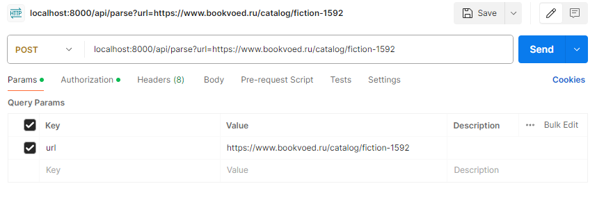
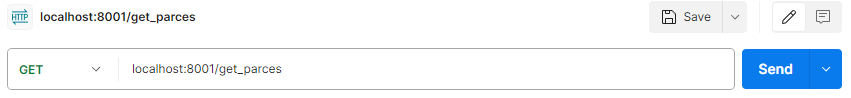
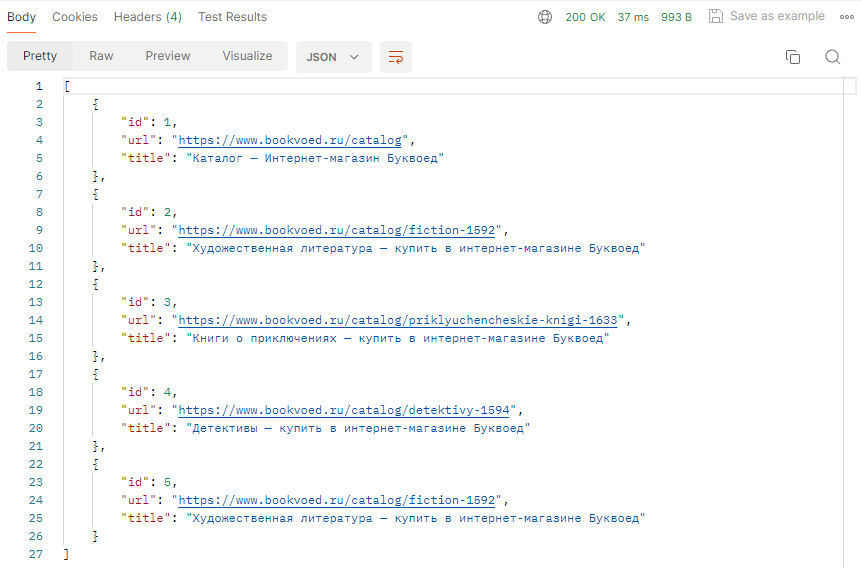

# Лабораторная работа 3: Упаковка FastAPI приложения в Docker, Работа с источниками данных и Очереди

---

## Цель

Научиться упаковывать FastAPI приложение в Docker,
интегрировать парсер данных с базой данных и вызывать парсер через API и очередь.

## Ход работы

В данной лабораторной работе было упаковано в контейнеры два приложения:<br>

- **travel_app** - первая лабораторная работа
- **docker_2** - по сути вторая лабораторная работа

**Dockerfile для travel_app:**

```python
FROM python:3.9.19-alpine3.20

WORKDIR .

COPY . .
RUN pip3 install -r requirements.txt

CMD uvicorn main:app --host localhost --port 8000
```

**docker-compose.yaml:**

```python
version: "3.9"
services:
  lab_3_bd:
    container_name: lab_3_bd
    image: postgres
    restart: always
    environment:
      - POSTGRES_PASSWORD=1122
      - POSTGRES_USER=postgres
      - POSTGRES_DB=web_data
      - POSTGRES_PORT=5432
    volumes:
      - postgres_data:/var/lib/postgresql/data/
    ports:
      - "5432:5432"
    networks:
      - backend

  travel_app:
    container_name: travel_app
    build:
      context: .
    env_file: .env
    depends_on:
      - lab_3_bd
    ports:
      - "8000:8000"
    command: uvicorn main:app --host 0.0.0.0 --port 8000
    networks:
      - backend
    restart: always

  docker_2:
    container_name: docker_2
    build:
      context: ./docker_2
    env_file: .env
    depends_on:
      - lab_3_bd
    ports:
      - "8001:8001"
    command: uvicorn main:app --host 0.0.0.0 --port 8001
    networks:
      - backend
    restart: always

  celery:
    build:
      context: .
    container_name: celery
    command: celery -A celery_app worker --loglevel=info
    restart: always
    depends_on:
      - redis
      - lab_3_bd
    networks:
      - backend

  redis:
    image: redis
    ports:
      - "6379:6379"
    networks:
      - backend

volumes:
  postgres_data:

networks:
  backend:
    driver: bridge
```

Также я использовал celery:<br>

**celery_app.py:**

```python
from celery import Celery

celery_app = Celery(
    "cel_app",
    broker="redis://redis:6379/0",
    backend="redis://redis:6379/0",
)

celery_app.conf.update(
    task_routes={
        "parse.parse_and_save": "main-queue",
    },
)

if __name__ == "__main__":
    celery_app.start()
```

Используется он следующим образом:

```python
@celery_app.task
def parse_and_save(url, session):
    response = requests.get(url)
    soup = BeautifulSoup(response.content, 'html.parser')
    title = soup.title.string if soup.title else 'No title'
    try_obj = Try(url=url, title=title)
    session.add(try_obj)
    session.commit()
    session.refresh(try_obj)
```

Эндпойнт **/parse**:<br>
Запрос:

Запись создана, теперь можем посмотреть все, что мы парсили.<br><br>
Эндпойнт **/get_parces**:<br>
Запрос:

Результат:

